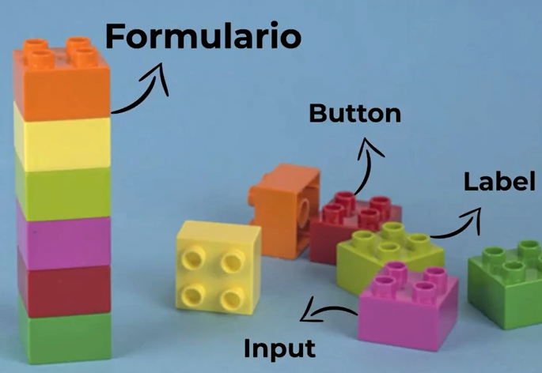

Los **componentes son la columna vertebral de los frameworks**, y son muy similares a las funciones, toma una entrada *props* y genera elementos de salida de interfaz. Ademas, **pueden ser reusados cuando estos se requieran en otros archivos**, esto se realiza mediante una invocación.

Para realizar la invocación se realiza a través de elementos HTML como por ejemplo `<Component Name/>`. Si recuerdas de tus clases de HTML, nosotros usábamos el backslash `/` para denotar un cierre de etiqueta, pues aquí se utilizara para realizar un llamado a un componente y se hace uso de un sintaxis conocida como JSX que es una especie de mezcla de HTML y Javascript.

La tendencia del desarrollo web es generar aplicaciones web mas con Javascript y menos con HTML puro, para aprovechar las ventajas de que Javascript es un lenguaje de programación.

## Resumen Historico del uso de HTML

**1993 Primera versión “formal” de HTML 1.0** : Aun usado en la maquetación de correos electrónicos.
**1995 HTML 2.0:** Etiquetas implementadas de imágenes, mapas de imágenes, formularios, estilos.
**1997 HTML 3.2:** Tablas, textos alrededor de imágenes, applets de Java.

**1999 HTML 4.01:** estándar desde el año 2000

**2008 Primer borrador de HTML 5** 

**2014 HTML 5 como estandar:** Como lo conocemos hoy en día.

## Que son los componentes?

Los componentes es aplicar un concepto muy parecido a las funciones para realizar maquetación, aprovechando las ventajas de un lenguaje de programación como estructuras de datos, parámetros, condicionales, ciclos, scopes, clousures, etc.

Y partir de estos componentes, podemos conformar los elementos que necesitamos para conforman una aplicación web. Estos componentes **son mutables** de acuerdo a las necesidades, y ademas podemos generar otros componentes generando **composiciones de componentes**.

Por ejemplo un componente puede ser un formulario, y dentro de ellos pueden existir componentes como botones, labels, inputs, entre otros.

La composición de componentes puede llevarse a una escala muy grande, donde se puede construir en base a componentes mas pequeños, aplicaciones con una escala muy considerable.

