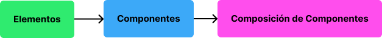
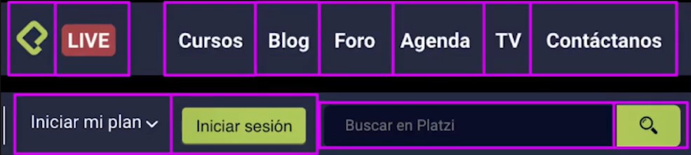
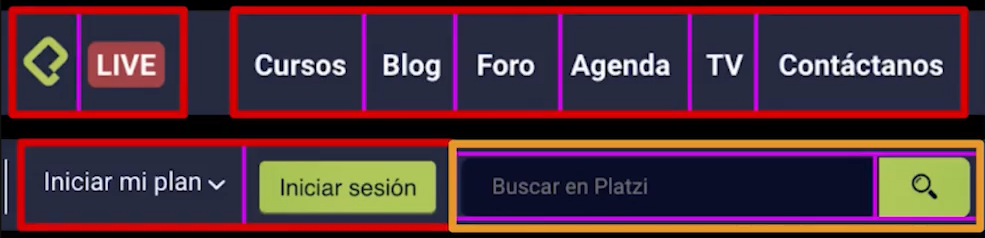
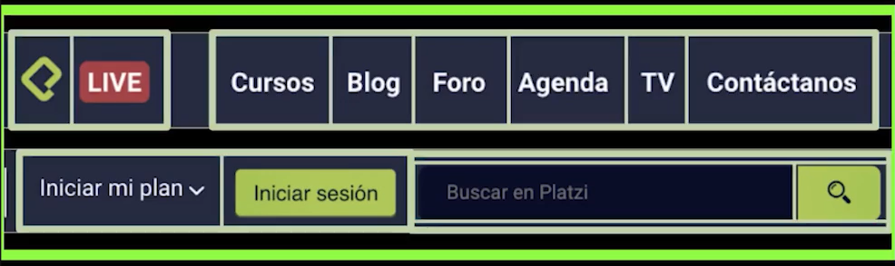
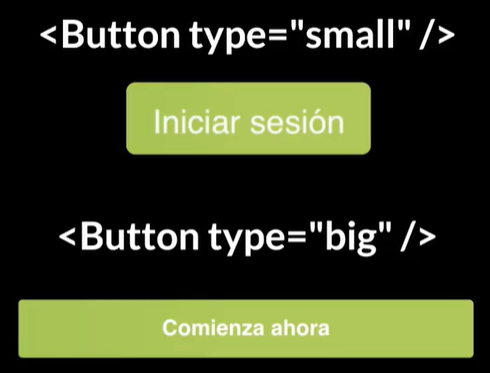
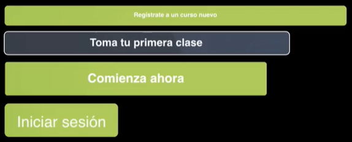

Es importante saber cuando un **elemento** o **varios elementos** de nuestra web se transforma en un **componente**, y después cuando varios componentes se convierten en una **composición de componentes**.



## Identificación de Elementos y Componentes

Podemos partir a través de un análisis a un mockup. Como por ejemplo supongamos que tenemos la barra de navegación de platzi. En esta barra de navegación yo puedo identificar varios elementos. 


Estos **elementos** serian:

- El Logo de Platzi

- Imagen de notificación o Banner de *Platzi Live*

- Cada uno de los elementos de la lista del menu verical como *Cursos*, *Blog*,* Foro*, *Agenda*, *TV* y *Contactanos*.

- El boton de anuncia a *Iniciar mi plan*.

- Un boton de *Inicio de Sesión*

- Un cuadro de texto de búsqueda.

- Un boton de con el icono de busqueda.



Podemos **transformar** a cada uno de estos **elementos** en un **componente**. Si observamos existen elementos/componentes con objetivos similares, a través de estos vamos a generar **composición de componentes**, entonces tendríamos:

- Un primer componente de Logo conformado por dos componentes, el Logo de Platzi, y el banner de notificación de una emisión en vivo.

- Un segundo componente se conformaría por los enlaces de las paginas mas importantes de Platzi. Cada enlace sera un componente, por ello al juntar todos se genera una composición de componentes que sera un menú vertical.

- Un tercer componente de puede ser un panel de planes y de incio de sesión.

- Por ultimo un componente que conforme la barra de búsqueda con el botón de búsqueda, conformando un panel de búsqueda.



Y juntando estas 4 composiciones de componentes, podemos generar un **componente padre** llamado **menú**.



Asi la composición de componentes puede anidar componentes y estos últimos anidar a otros componentes y sucesivamente.

Ahora el componente padre **menú** **puede cambiar dependiendo del tipo de usuario** que este observando nuestro aplicación web. Es decir si hay alguien que no se ha suscrito en el sitio web, se mostrara el menú que acabamos de analizar, pero si es un usuario suscrito y logeado entonces se mostrara otros botones y otros banners de notificación.

## Atributos de un Componente

Como habíamos dicho anteriormente la composición de componente llamada menú tenia que cambiar de acuerdo al usuario. Estos cambios se clasificarían de acuerdo a atributos que le coloquemos a un componente, que son una especie de argumentos y parámetros de una función.

Por ejemplo para un botón, donde el componente se llame `<Button />`, este puede tener un argumento que defina su tamaño a través de `type`, de esta manera a partir de dos valores de `small` y `big` podríamos generar los botones.



Como observamos en la imagen, los botones son muy similares estéticamente, y en lo que se diferencian únicamente es en el tamaño. De esta manera podemos **agrupar** varios  tipos de botones y generar un **componente**, donde los diferenciaríamos a través de  atributos, donde estos caracterizaran su objetivo.

### Botones SalesButton

Por ejemplo podemos agrupar botones con objetivos como registrar, iniciar sesión, prueba gratuita, toma tu primera clase y diferenciarlos por los atributos de `type` y `size`.

Donde el primer atributo `type` tendrá valores de `primary` o `secondary`. Y el atributo `size` caracterizara el tamaño del botón con `small`, `big` y `ultrabig`.

```jsx
<SalesButton type='primary' size='ultrabig' />
<SalesButton type='secondary' size='big' />
<SalesButton type='primary' size='big' />
<SalesButton type='primary' size='small' />
```



### Botones StudentButton

Si has visto botones con iconos, te aviso que podemos tambien introducir atributos utilizando otros componentes en este caso son iconos.

```jsx
<StudentButton icon={<PlayIcon />}/>
<StudentButton icon={<CapeIcon />}/>
<StudentButton />
```


:::(Info) (Terminología de Componente y Composición de Componentes)
Recuerda que que cuando digamos *"componente"* nos podemos referir tanto a que es un componente puro o también nos podemos referir a una composición de componentes, el termino se lo utiliza indistintamente.
:::

### Componente Dropdown

Un componente bien conocido a la hora de cambiar su contenido son los *dropdown*, que sera una composición de componentes formada por un componente visible y si existe una interacción con un click o un tap aparecerá otra componente que mantenía oculto. Estos componentes pueden tener los siguientes atributos: `ClickArea` que sera el ente con el cual hay que interactuar, para que el componente con el atributo `HiddenArea` aparezca.

:::(Info) (Importante)

Si recordamos las etiquetas de HTML, nosotros podíamos insertar atributos con valores o únicamente atributos sin valor, que definían un comportamiento de la etiqueta. Pues para la sintaxis JSX también existe componentes que tienen atributos con valores  y atributos sin valores que definen un comportamiento.

:::

```jsx
<Button ClickArea />
<ListPlans HiddenArea />

<UserPoints ClickArea/>
<ProfileMenu HiddenArea/>

<NotifyButton ClickArea />
<ListItems HiddenArea />
```


## Componentes en página de Home de Platzi

Podemos conformar a la página de inicio de Platzi como una serie de componentes.


Para efectos didácticos, usaremos el siguiente código que se usa en el framework de React para analizar la pagina de home.

```jsx
const Home = (props) => ({
    <>
        <Menu user={props.user} />
        <Hero>
            <Title>Fórmate online...</Title>
            <Description text='70%..'/>
            <Description text='20%...'/>
            <RegisterForm />
            <Description text='Al ingresar...'>
        </Hero>
    </>
});
```

Aqui tenemos un componente `<Menu />` con un argumento de `use='props.user'` el cual nos dirá si el usuario esta logeado y de acuerdo a eso mostrarle un menú personalizado. Para ello el componente menú estará formado por:

```jsx
const Menu = props => ({
    <Nav>
        <Logo badge={<Live />} />
        <Links list={props.links} />
        {!prop.user ? (<LoginButtons />) : <UserPreview {...props.user} />}
    </Nav>
});
```

Tenemos un componente logo `<Logo badge={<Live/>} />` con atributo del banner de Live. Tambien tenemos un componente con los enlaces de las paginas mas importantes de Platzi con `<Links list={props.links} />` , si vemos usamos un atributo de list, pasandole una variable de `props.links` que sera un array con todos los enlaces. 

Luego usamos un operador ternario para decir que si el estado de sesión del usuario `props.user` es `False` entonces mostrara los botones de login, mientras que si es `True` entonces mostrara el menú de usuario `<UserPreview {...props.user}>` con argumetos el nombre del usuario, y que dentro de este componente es muy problable que exista un componente *dropdown*.

Ahora si deseamos generar un componente de botón como:

```jsx
const Button = (props) => ({
    <button
        className={`btn ${props.size}`}
    />
        {props.text}
    </button>
});
```

Generamos una etiqueta HTML de botón y le daremos estilos a través del argumento `className`, y si observamos mantiene una clase `btn`, le añadimos también una clase extra con la variable `props.size` que nos dará el tamaño del botón. Despues le daremos el contenido de la variable `props.text`.

Ahora bien, recuerdas que teníamos varios botones de distintos tamaños `small`, `big` y `ultrabig`, pues un consejo practico a la hora de implementarlos, es que en vez de estar configurando los atributos cada vez que realizamos el llamado al componente boton como `<Button size='small' />`, es generar un nuevo componente a partir de este, de manera que:

```jsx
const Button = (props) => ({
    <button className={`btn ${props.size}`}>
    </button>
});

const BigButton = (props) => ({
    <Button size='big' {...props}/>
});

const SmallButton = (prop) => ({
    <Button size='small' {...props} />
});
```

De esta forma al realizar el llamado a un botón de diferente tamaño únicamente tendremos que colocar el nombre del componente como `<BigButton />` o `SmallButton`.

**Contribución realizada por:** David Castillo
